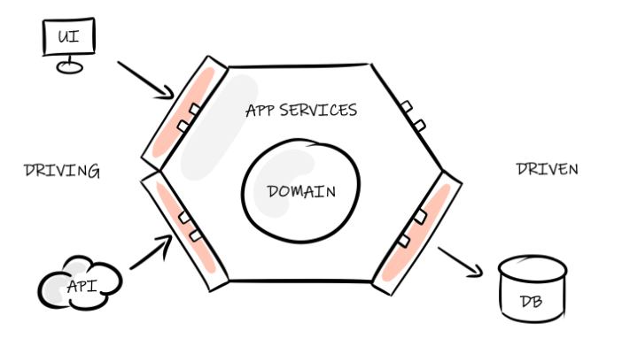

# 💰 **Bank Account Application** 💰

### 🧩 Feature 1: The Bank Account

A **bank account** must allow the following basic operations:

* Have a **unique account number** (any format)
* Manage a **balance**
* Allow **money deposits**
* Allow **money withdrawals**

**Business rule:**
A withdrawal cannot be made if it exceeds the available balance.

---

### 💳 Feature 2: Authorized Overdraft

Some bank accounts may have an **authorized overdraft**.

**Business rule:**

* If an account has an authorized overdraft, a withdrawal exceeding the balance is allowed **only if** the resulting balance does not exceed the overdraft limit.

---

### 💰 Feature 3: Savings Account

A **savings account** is a specific type of bank account with additional constraints:

* It has a **deposit limit** — deposits can only be made up to the account’s maximum balance (for example: €22,950 for a Livret A)
* It **cannot have an authorized overdraft**

---

### 📄 Feature 4: Account Statement

A **monthly statement** must be generated for each account.
This statement must display the following information:

* The **account type** (Current Account or Savings Account)
* The **account balance** at the date the statement is issued
* The **list of transactions** made during the month, **sorted by date in descending order**

---

## 🧱 Target Architecture

The application should follow the principles of **Hexagonal Architecture**:

* The **domain** contains the pure business logic
* The **ports** define the interfaces used to interact with the domain
* The **adapters** implement these interfaces (e.g., REST API, persistence layer, etc.)

---

